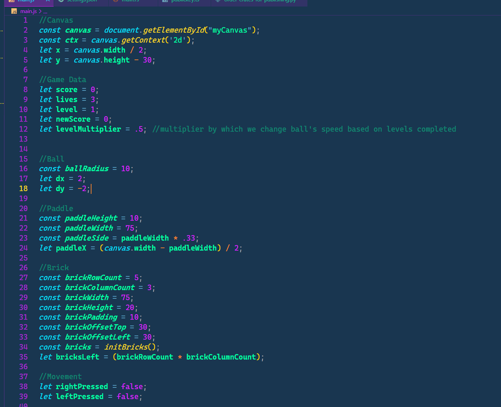
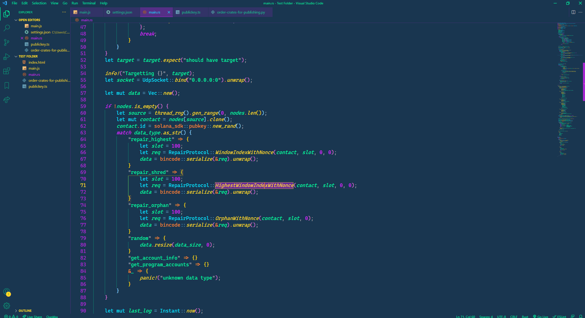

# README

**THIS HAS NOT BEEN UPDATED IN A VERY LONG TIME. THERE MAY BE ISSUES. IF YOU HAVE SUGGESTIONS HIT ME UP.**

A Visual Studio Code theme for the solana summer folks out there, just in time for the hackathon.

- All colors and styles can be overwriten using the normal VSCode methods: https://code.visualstudio.com/docs/introvideos/configure

- Currently we natively support Rust + JS however more are on the way, it will work for everything, just better with what i've done manually thus far :)

### For more information

- Follow me on twitter: https://twitter.com/EggNamedCregg send me suggestions, questions, comments, concerns and platitudes.
- If you wanna support my solana addiction by sending my SOL or the token of your choice: J6ebHsiGHPZ4vouKVKukgbuK1SiwYgaV2CwfT5N35dF9

**Enjoy!**
